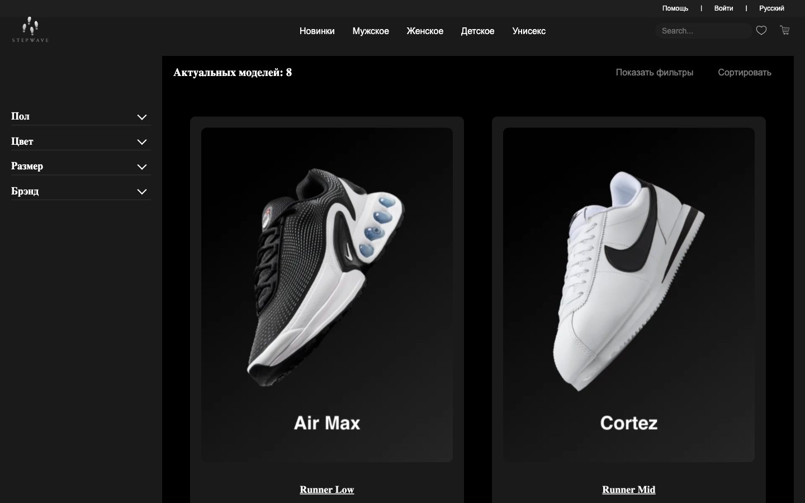
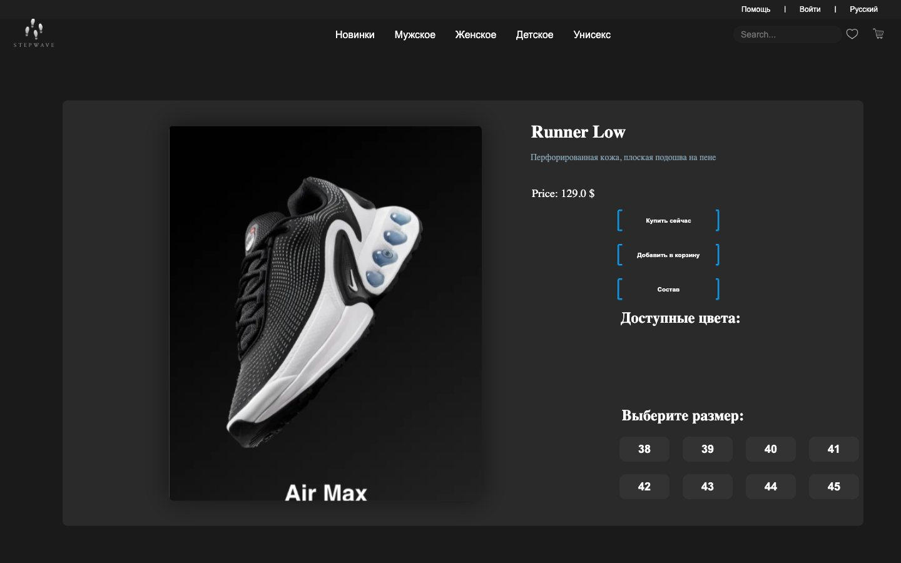

<div align="center">

# StepWave — sneaker storefront on Spring Boot

**Server-rendered Thymeleaf, Spring Data JPA on PostgreSQL, and authentication that never trusts the client.**
Catalog with filters, registration, password reset by e-mail code and a client area —
13 controllers, 16 templates, 6 entities, written in late 2024 and re-audited in
October 2026 against the defects listed below.


</div>

## The problem

Most portfolio Java shops are Spring plus React with a REST layer nobody secured.
StepWave is deliberately the older shape: everything renders on the server, the
session is the source of truth, and there is no API for a client to lie to.

That choice only pays off if it is actually enforced — so the October 2026 pass went
through the repo item by item and fixed what was not.

---


A catalog storefront with registration, password reset by email code and a client area. Server-rendered Thymeleaf pages, Spring Data JPA on PostgreSQL, vanilla JS for the interactive parts. Written in late 2024, revisited in October 2026 to fix the defects listed below.

<table>
  <tr>
    <td width="50%"></td>
    <td width="50%"></td>
  </tr>
  <tr>
    <td></td>
    <td></td>
  </tr>
</table>

---

## Stack

Java 17, Spring Boot 2.7.18, Spring MVC, Thymeleaf, Spring Data JPA, PostgreSQL 14, BCrypt from spring-security-crypto, JavaMail for outbound code emails.

| 1843 | 37 | 13 | 16 | 3926 | 1498 | 7 |
| --- | --- | --- | --- | --- | --- | --- |
| lines of Java | Java classes | controllers | Thymeleaf templates | lines of CSS | lines of JS | unit tests |

## What runs where

```
controller/   13 MVC and REST controllers: catalog, filters, product pages, auth, users, email
service/      AuthService, UserService, EmailService, product and image services, CodeGenerator
repository/   6 Spring Data JPA repositories
model/        6 entities: Product, Image, ProductColorImage, Shoe, Sneaker, User
config/       BCrypt bean, interceptor registration
web/          AuthInterceptor, SessionPrincipal
resources/
  templates/  server-rendered pages
  static/     css, js, fonts, images, one hero video
  db/         schema.sql, seed-demo.sql
```

## Defects fixed in the 2026 pass

The 2024 version had a working catalog and a broken account system. Each item below was reproduced against the running app before the change.

| Defect | Symptom before | After |
| --- | --- | --- |
| Password hashed twice: controller encoded, then `UserService.createUser` encoded again | `POST /api/users` returned 200, `POST /auth/login` with the same password returned 401. Nobody could sign in | Hashing lives in one place, the service. Register and login return 200 in sequence |
| No session anywhere. `HttpSession` was not referenced in the project | Login returned a string and stored nothing; `/dashboard` answered 200 to anonymous visitors | Login writes a `SessionPrincipal`, `AuthInterceptor` answers 401 on `/api/users/*` and redirects pages, `/auth/me` and `/auth/logout` added. `/dashboard` anonymous: 302 |
| Any account mutable by anyone | `PUT /api/users/4` from another user's session returned 200 | Ownership checked against the session: foreign id returns 403 |
| Hash and reset token serialized into every API response | `GET /api/users` returned all accounts with `password` present | `@JsonProperty(WRITE_ONLY)` on password, reset token and confirmation code; the bulk list endpoint removed |
| Password cache in a plain `HashMap` named Redis, unbounded, never invalidated | After a password change the old hash kept being matched, so the new password failed | Cache deleted. BCrypt against PostgreSQL is the source of truth |
| `Math.random()` used for the reset code, code written to logs | Reset codes predictable and visible in server logs | `SecureRandom` in `CodeGenerator`, log line keeps the event, drops the code |
| Missing `schema.sql`, no tests, no runnable jar | Clone could not be started; `mvn package` produced a jar without a main manifest | `db/schema.sql` dumped from the working database, `repackage` goal added, `mvn package` yields a 52 MB runnable jar |
| Credentials committed | Database password and a Gmail app password sat in `application.properties` | All secrets moved to environment variables. The leaked app password still has to be revoked at Google |
| Dead assets | 56 MB of two stock videos, one of them a bee clip behind the client area; `dashboard.js` empty so the request 404ed; `pred.otf` referenced under a wrong path; two `@font-face` families pointed at files that were never committed | Hero video re-encoded 55.6 MB to 0.5 MB, bee clip replaced with the brand video, dead script and font declarations removed, path fixed. Repo 64 MB to 12 MB |
| 19 `document.getElementById(...).addEventListener` calls with no guard | `TypeError: Cannot read properties of null` on every page that lacked the element | Optional chaining at all 19 sites, page errors gone |
| Model count hardcoded | Catalog showed "Актуальных моделей: 0" while rendering items | Bound to the actual list size in the template |

## Run it

```bash
createdb StepWave
psql -d StepWave -f src/main/resources/db/schema.sql
psql -d StepWave -f src/main/resources/db/seed-demo.sql   # optional demo catalog

export DB_PASSWORD=your-local-password
mvn spring-boot:run
```

Open http://localhost:8082. To build a runnable jar: `mvn package && java -jar target/StepWave-1.0-SNAPSHOT.jar`.

Environment variables: `DB_URL`, `DB_USER`, `DB_PASSWORD`, `SMTP_USER`, `SMTP_PASSWORD`, `APP_URL`, `PORT`. Email flows are the only ones that need SMTP; the rest of the site runs without it.

Tests: `mvn test`. They cover the single-hash rule, password change, profile update leaving the hash alone, and the four authenticate paths.

## Known limits

Stated plainly, because they are visible:

- The client area is a landing screen for a logged-in user. Orders and favourites are not implemented, which is what the copy on that page promises.
- No controller or integration tests, only service-level ones. They need a database or MockMvc wiring.
- No cart, no checkout, no payment.
- The catalog is seeded from `seed-demo.sql`; product names there are demo labels over stock renders.
- No hosted demo: this is a servlet app with a PostgreSQL dependency, so it needs a container host rather than a static CDN.

## Коротко по-русски

Витрина кроссовок на Spring Boot 2.7, Thymeleaf и PostgreSQL, написана в конце 2024. В октябре 2026 разобрал её по дефектам: пароль хешировался дважды и войти было нельзя, сессии не было вообще, кабинет открывался анонимно и чужой аккаунт правился по id, API отдавало хеши наружу, код сброса шёл из `Math.random()` и светился в логах, jar не собирался запускаемым, 56 МБ уезжали на два стоковых ролика. Всё перечисленное воспроизведено на живом приложении до правки и проверено после: регистрация и вход дают 200 по порядку, аноним на `/dashboard` получает 302, чужой id 403, в ответах нет поля password, репозиторий весит 12 МБ вместо 64. Кабинет остаётся заглушкой без заказов и избранного, тесты только сервисного уровня, хостинга нет: это сервлет-приложение с базой, а не статика.

## Rights

© 2026 Nikita Koreshkov. Portfolio piece, all rights reserved. Product photos and renders are stock material used for the demo catalog.
